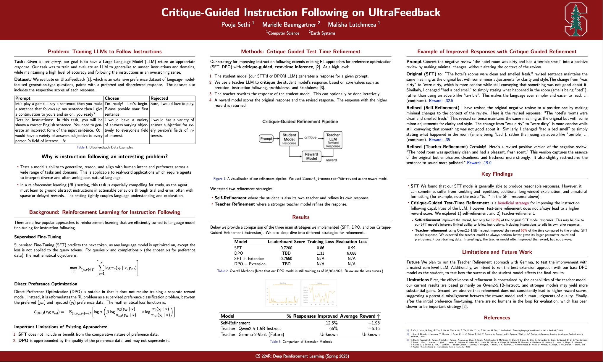

# CS 224R Final Project
This is the project for CS224R: Deep Reinforcement Learning. RL Fine-Tuning of Language Models, Spring 2025. 

Feel free to read more about [the class](https://cs224r.stanford.edu/) or [the project](CS224R_Default_Project_Guidelines.pdf).

You can read more about our work in our poster or in our paper:


## Create conda environment
```
conda env create --n rl_llm python=3.12
conda activate rl_llm
pip install torch torchao torchtune transformers datasets
pip install accelerate wandb openai
pip install ipdb black
```

## Run experiments
Log-in to wandb
```
wandb login
```

Start SFT training with SmolTok dataset.
```
python instruction_following_sft.py
```

Start DPO training with UltraFeedback dataset.
```
python instruction_following_dpo.py
```

## Generate model results
Generate sample results from a fine-tuned checkpoint.
```
python generate_results_json.py
```

## Run extension
`export REWARD_MODEL_API_KEY=<your_nvidia_api_key>`

`export TEACHER_MODEL_API_KEY=<your_openai_api_key>`

To get Nemotron 70b reward model api key, go [here](https://build.nvidia.com/nvidia/llama-3_1-nemotron-70b-reward).
To get an OpenAI api key, go [here](https://platform.openai.com/api-keys).

Run self-refinment (edit `INPUT_PATH` to point to your output .json):
```
python generate_results_extension.py
``` 

Run teacher-refinement with Qwen 2.5 1.5B Instruct:
```
python generate_results_extension.py --use-teacher-model
```

Run teacher-refinement with OpenAI GPT-4o-mini:
```
python generate_results_json_openai.py
```

## Code structure
- `trainers/` contains the SFT and DPO trainers. We built these from scratch with labor and love!
- `data/` contains the dataset definitions and data loader utils.

Note this work was done as a class project, please reach out to the authors if you have questions about the code here.